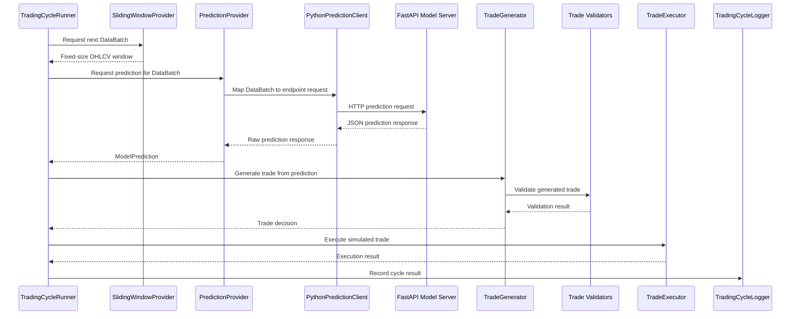
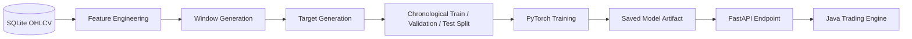

# Overview

Algotrader is a configurable intraday algorithmic trading platform designed for historical backtesting and future paper trading. The system combines a Java-based trading engine with Python machine learning models to evaluate market data and generate trading decisions.

Historical OHLCV market data is collected from external providers and stored in a local SQLite database. During each trading cycle, the Java application retrieves a sliding window of market data, requests predictions from a FastAPI model server, interprets the resulting signals according to configurable trading strategies, and simulates trade execution.

The platform emphasizes modularity and separation of concerns. Prediction models, trading strategies, market data sources, and execution components are all independently configurable, enabling rapid experimentation without modifying core application logic.

The current implementation focuses on single-ticker intraday strategies using fixed-horizon round-trip trades and supports models that predict the probability of favorable price movements and optionally the expected volatility of those movements. Regression infrastructure exists but regression-based trading workflows are not yet implemented.

Core technologies: Java 17, Python, FastAPI, PyTorch, SQLite, Maven.

## Key Design Decisions

The current architecture prioritizes maintainability, modularity, and rapid experimentation over low-latency execution or horizontal scalability.

### Why SQLite?

Historical market data is stored in a local SQLite database.

SQLite was selected because it provides:

* zero-configuration deployment,
* strong query capabilities,
* transactional consistency,
* sufficient performance for historical backtesting workloads,
* and a single portable database file.

Compared to CSV-based storage, SQLite simplifies indexing, range queries, upserts, and support for multiple tickers and intervals.

The project currently operates as a single-user application with moderate data volumes, making a client-server database unnecessary. Repository abstractions isolate the storage layer, allowing the underlying database technology to be replaced in the future if requirements change.

### Why Separate Java and Python?

The trading engine and machine learning components are implemented as separate services.

Java is responsible for:

* configuration management,
* runtime orchestration,
* market data access,
* trade generation,
* execution simulation,
* and logging.

Python is responsible for:

* feature engineering,
* model training,
* model inference,
* and serving prediction endpoints.

This separation allows each language to be used where it is strongest. Java provides a robust, strongly typed foundation for long-lived application logic, while Python provides access to the broader machine learning ecosystem, including PyTorch, NumPy, and related tooling.

Communication between the two services occurs through HTTP and JSON.

This service boundary enables:

* independent development and deployment,
* model updates without modifying the trading engine,
* support for multiple prediction endpoints,
* easier experimentation with new models,
* and clearer separation of concerns.

The additional network overhead is acceptable because the system targets intraday trading strategies rather than latency-sensitive high-frequency trading workloads.


## Goals and Non-Goals

### Goals

* Provide a flexible platform for developing and evaluating intraday algorithmic trading strategies.
* Enable reproducible historical backtesting using locally stored market data.
* Support rapid experimentation with machine learning models without requiring changes to core trading logic.
* Maintain a clear separation of concerns between data ingestion, prediction, strategy evaluation, execution, and logging.
* Allow prediction models to be developed and deployed independently from the trading engine.
* Support multiple prediction types and strategy implementations through configuration rather than code changes.
* Ensure components are modular, testable, and easy to extend.
* Preserve a complete audit trail of trading decisions, predictions, and execution outcomes.
* Facilitate future expansion to paper trading with minimal architectural changes.
* Prioritize readability and maintainability over premature optimization.

### Non-Goals

* High-frequency or low-latency trading.
* Direct integration with live brokerage APIs.
* Automated live trading with real capital.
* Portfolio optimization across multiple assets.
* Position sizing, capital allocation, or risk management beyond single-trade decision logic.
* Tick-level market simulation or order book modeling.
* Distributed processing or horizontal scalability.
* Real-time streaming data ingestion.
* Guaranteed profitability or production-grade investment advice.
* Optimization for large-scale institutional trading workloads.

### Current Scope

The current implementation focuses on single-ticker intraday strategies using fixed-horizon round-trip trades. Predictions are generated from fixed-size windows of historical OHLCV data and evaluated through configurable classification-based workflows during historical backtests.

## System Diagram

## Component Architecture

Algotrader is organized around a small set of subsystems with clearly separated responsibilities. The Java application is responsible for orchestration, configuration, market data access, trade generation, execution simulation, and logging. The Python application is responsible for machine learning feature transformation and model inference.

### Configuration

The configuration subsystem loads external JSON configuration files and converts them into strongly typed runtime objects. These configuration files define trading sessions, prediction endpoints, trade generation strategies, and market calendar rules.

Key packages:

```text
com.algotrader.config
com.algotrader.runtime
```

Primary responsibilities:

* Load trading session, endpoint, strategy, and calendar configuration.
* Resolve related configuration files into a complete `ResolvedTradingPlan`.
* Keep runtime behavior configurable without requiring code changes.
* Validate required strategy parameters before a trading run begins.

### Runtime Orchestration

The runtime subsystem coordinates the lifecycle of a trading run. It initializes the required components, advances through available market data windows, requests predictions, generates trades, executes simulated orders, and records results.

Key packages:

```text
com.algotrader.runtime
com.algotrader.service
```

Primary responsibilities:

* Build the object graph required for a trading session.
* Coordinate trading cycles from start to finish.
* Stop execution when no valid market data windows remain.
* Keep high-level application flow separate from individual implementation details.

### Market Data

The market data subsystem provides historical OHLCV data to the trading engine. Market data is stored in SQLite and exposed to the rest of the application through repository and provider abstractions.

Key packages:

```text
com.algotrader.marketdata
com.algotrader.marketdata.provider
com.algotrader.marketdata.repository
```

Primary responsibilities:

* Read historical candle data from SQLite.
* Provide fixed-size sliding windows of market data.
* Support interval-aware queries such as one-minute and five-minute candles.
* Hide storage details from the trading and prediction layers.

### Data Ingestion

The data ingestion subsystem updates the local market data store from external data providers. It is implemented separately from the Java trading engine so historical data can be refreshed independently from backtest execution.

Key locations:

```text
data-ingestion/
data/
```

Primary responsibilities:

* Download OHLCV data for configured tickers and intervals.
* Insert or update records in the local SQLite database.
* Avoid unnecessary downloads by checking the latest stored timestamp.
* Keep the database current for backtesting and future paper trading.

### Prediction

The prediction subsystem connects Java trading logic to machine learning model outputs. It maps market data batches into endpoint-specific request payloads, sends them to the Python model server, and converts JSON responses into domain-level prediction objects.

Key packages:

```text
com.algotrader.decision.prediction
com.algotrader.decision.prediction.provider
com.algotrader.decision.prediction.client
com.algotrader.decision.prediction.mapper
com.algotrader.decision.dataobjects
```

Primary responsibilities:

* Select the correct prediction provider based on the configured endpoint type.
* Convert `DataBatch` objects into model request payloads.
* Call Python prediction endpoints over HTTP.
* Convert model responses into `ModelPrediction` implementations.
* Support multiple prediction types, including classification and classification with volatility.

### Python Model Server

The Python model server hosts trained machine learning models behind HTTP endpoints. It handles feature transformation, model loading, inference, and response formatting.

Key locations:

```text
python-model/app
python-model/training
python-model/saved_models
```

Primary responsibilities:

* Serve prediction endpoints through FastAPI.
* Load trained PyTorch model files.
* Transform OHLCV windows into model-ready feature tensors.
* Return prediction responses in a format consumed by the Java application.
* Allow model development to evolve independently from the Java trading engine.

### Decision and Trade Generation

The decision subsystem converts model predictions into trade recommendations. It separates raw model outputs from strategy interpretation so different strategies can consume the same prediction types.

Key packages:

```text
com.algotrader.decision
com.algotrader.decision.generator
com.algotrader.decision.interpreter
com.algotrader.decision.validation
```

Primary responsibilities:

* Interpret model predictions according to configured strategy parameters.
* Generate fixed-horizon round-trip trades.
* Apply confidence, volatility, and timing constraints.
* Validate generated trades before execution.
* Keep strategy logic independent from model-serving details.

### Execution

The execution subsystem simulates trade execution during historical backtests. It checks whether prices are available at the intended entry and exit timestamps and records the resulting trade outcome.

Key packages:

```text
com.algotrader.execution
com.algotrader.execution.validation
```

Primary responsibilities:

* Simulate historical trade execution.
* Validate that required market prices exist.
* Produce execution results for logging and analysis.
* Keep execution behavior separate from signal generation.

### Market Calendar

The market calendar subsystem determines whether a timestamp falls within a valid trading session and helps prevent trades from being opened too close to market close.

Key packages:

```text
com.algotrader.marketcalendar
```

Primary responsibilities:

* Represent regular market open and close times.
* Support early-close days and market holidays.
* Validate whether trades fit inside the active trading session.
* Prevent overnight positions in fixed-horizon round-trip strategies.

### Logging

The logging subsystem records trading cycle results, predictions, generated trades, validation outcomes, and execution results. These logs provide an audit trail for evaluating strategy behavior after a backtest run.

Key packages:

```text
com.algotrader.logging
```

Primary responsibilities:

* Record each trading cycle.
* Preserve prediction and trade decision details.
* Support post-run analysis and debugging.
* Make backtest behavior reproducible and inspectable.

## Data Flow

A trading cycle represents one complete pass through the system for a single market data window. During each cycle, the Java trading engine retrieves historical OHLCV candles, sends them to the configured prediction endpoint, interprets the returned prediction, validates any generated trade, simulates execution, and records the result.



### Trading Cycle Steps

1. The `TradingCycleRunner` requests the next available market data window from the `SlidingWindowProvider`.

2. The `SlidingWindowProvider` returns a fixed-size `DataBatch` containing historical OHLCV candles for the configured ticker, interval, and lookback size.

3. The `PredictionProvider` receives the `DataBatch` and selects the prediction workflow associated with the configured endpoint type.

4. The `PythonPredictionClient` uses an endpoint-specific request mapper to convert the `DataBatch` into the JSON format expected by the Python model server.

5. The FastAPI model server transforms the OHLCV window into model features, runs inference using the configured PyTorch model, and returns a JSON prediction response.

6. The Java prediction provider converts the JSON response into a domain-level `ModelPrediction`, such as a classification prediction or classification-with-volatility prediction.

7. The `TradeGenerator` passes the `ModelPrediction` to a `PredictionInterpreter`, which applies the configured strategy rules.

8. If the prediction satisfies the strategy requirements, the interpreter creates a proposed `RoundTripTrade` with an entry timestamp, exit timestamp, quantity, confidence, and strategy identifier.

9. Trade validators check whether the proposed trade is structurally valid and fits within the configured market session constraints.

10. The `TradeExecutor` simulates execution against historical market data by checking price availability at the intended entry and exit timestamps.

11. The `TradingCycleLogger` records the prediction, trade decision, validation result, execution result, and other cycle metadata.

12. The runner advances to the next available window and repeats the process until no valid windows remain.

### Flow Characteristics

* Market data flows from SQLite into the Java application through provider abstractions.
* Prediction requests flow from Java to Python over HTTP.
* Model outputs are converted into Java domain objects before strategy logic is applied.
* Trade generation is separated from execution so strategies can be tested independently from execution mechanics.
* Each cycle is logged to preserve an auditable record of model behavior and trading decisions.

## Core Domain Concepts

This section defines the most important objects and terms used throughout the system. The concepts are presented in roughly the same order they appear during a trading cycle, beginning with session initialization and ending with trade execution and logging.

### ResolvedTradingPlan

`ResolvedTradingPlan` is the central runtime object used to configure a trading session.

It combines all configuration required to execute a trading run into a single, fully validated object, including:

* trading session settings,
* prediction endpoint details,
* trade generation strategy settings,
* and market calendar rules.

The trading engine uses the `ResolvedTradingPlan` to construct the components required for a trading cycle.

### TradingCycleRunner

`TradingCycleRunner` coordinates the execution of a trading session.

Using a `ResolvedTradingPlan`, it initializes the required components and repeatedly executes trading cycles until no valid market data windows remain.

During each cycle, the runner:

1. retrieves the next market data window,
2. requests a model prediction,
3. generates and validates a trade,
4. simulates execution,
5. and records the result.

### SlidingWindowProvider

`SlidingWindowProvider` produces sequential windows of historical market data.

Each call advances the simulation forward by one interval and returns the next available `DataBatch`.

This allows the system to simulate historical trading decisions using only the information that would have been available at a given point in time.

### DataBatch

`DataBatch` is a fixed-size collection of historical market data for a single ticker and interval.

It is the primary input to the prediction system.

A `DataBatch` contains:

* an ordered list of OHLCV candles,
* ticker,
* interval,
* starting timestamp,
* and final timestamp.

For example, a prediction endpoint may require the most recent 30 five-minute candles to generate a prediction about the next 30 minutes of market behavior.

### OHLCV Candle

An OHLCV candle represents market activity over a fixed time interval.

Each candle contains:

* Open price
* High price
* Low price
* Close price
* Volume
* Ticker
* Interval
* Timestamp

OHLCV candles are the fundamental unit of market data throughout the system.

### TimeInterval

`TimeInterval` defines the duration represented by an OHLCV candle.

Examples include:

* one minute,
* five minutes,
* and other supported intervals.

The interval determines:

* how market data is queried,
* how sliding windows advance,
* how prediction horizons are interpreted,
* and how timestamps are incremented during a trading session.

### PredictionProvider

`PredictionProvider` converts a `DataBatch` into a `ModelPrediction`.

It acts as the bridge between the Java trading engine and the Python model server.

Prediction providers are responsible for:

* selecting the appropriate prediction workflow,
* transforming market data into endpoint requests,
* invoking prediction endpoints,
* and converting responses into domain objects.

### PredictionRequestMapper

`PredictionRequestMapper` converts a `DataBatch` into the JSON request format expected by a specific prediction endpoint.

Different models may require different request structures, so request mapping is separated from the generic prediction client.

### PythonPredictionClient

`PythonPredictionClient` handles communication with the Python model server.

It sends HTTP requests to configured prediction endpoints and returns the resulting JSON responses.

The client itself remains independent of any specific model type by delegating request construction to `PredictionRequestMapper` implementations.

### ModelPrediction

`ModelPrediction` is the common interface for all prediction results returned by machine learning models.

It provides a shared abstraction that allows downstream components to consume predictions without knowing the details of a specific model implementation.

Common prediction metadata includes:

* ticker,
* interval,
* final input timestamp,
* and prediction summary information.

### PredictionType

`PredictionType` identifies the category of output produced by a prediction endpoint.

Current prediction types include:

* `CLASSIFICATION`
* `CLASSIFICATION_WITH_VOLATILITY`
* `REGRESSION`

`REGRESSION` is currently a placeholder for future support.

### ClassificationPrediction

`ClassificationPrediction` represents a model output that estimates the probability that a future return will exceed a configured threshold within a fixed prediction horizon.

Typical fields include:

* predicted label,
* confidence,
* prediction horizon,
* and final input timestamp.

### ClassificationWithVolatilityPrediction

`ClassificationWithVolatilityPrediction` extends classification predictions by including an estimate of future volatility.

This allows trading strategies to consider both expected return potential and expected risk.

Typical fields include:

* probability,
* predicted volatility,
* prediction horizon,
* source `DataBatch`,
* and final input timestamp.

### TradeGenerator

`TradeGenerator` converts model predictions into trade decisions.

It coordinates prediction interpretation and trade validation while remaining independent of the underlying prediction source.

A trade generator may choose to:

* create a trade,
* reject a trade opportunity,
* or defer to validation logic.

### PredictionInterpreter

`PredictionInterpreter` contains the strategy-specific logic used to interpret a `ModelPrediction`.

For example, an interpreter may require:

* prediction confidence above a minimum threshold,
* predicted volatility below a maximum threshold,
* and sufficient time remaining before market close.

### RoundTripTrade

`RoundTripTrade` represents a complete intraday trade with both an entry and exit.

It contains:

* ticker,
* quantity,
* entry timestamp,
* exit timestamp,
* confidence,
* and strategy identifier.

The project currently focuses on fixed-horizon round-trip trades to avoid holding positions overnight.

### TradeValidator

A `TradeValidator` verifies that a proposed trade is valid before execution.

Validation may include:

* ensuring the exit time occurs after the entry time,
* ensuring the trade remains within market hours,
* enforcing minimum time-before-close rules,
* and verifying internal trade consistency.

### MarketCalendar

`MarketCalendar` determines whether a timestamp falls within a valid trading session.

It accounts for:

* market open and close times,
* holidays,
* early closes,
* and session-specific constraints.

The market calendar helps ensure that generated trades can be opened and closed during valid market hours.

### TradeExecutor

`TradeExecutor` simulates execution of validated trades using historical market data.

During backtesting, the executor verifies that prices are available at the intended entry and exit timestamps and produces an execution result.

### TradingCycleLogger

`TradingCycleLogger` records the outcome of each trading cycle.

Logs provide an audit trail containing:

* market data window metadata,
* model predictions,
* trade decisions,
* validation outcomes,
* execution results,
* and runtime errors.

These records enable reproducible backtests and support post-run analysis and debugging.

## Configuration System

Algotrader uses a configuration-driven architecture to separate trading logic from implementation details. Trading sessions, prediction endpoints, and strategy behavior are defined in external JSON files rather than hard-coded in the application.

This approach allows new models, strategies, and backtest scenarios to be introduced without modifying the core trading engine.

The configuration system is built around three primary configuration types:

* `TradingSessionConfig`
* `EndpointConfig`
* `TradeGeneratorConfig`

During application startup, these configurations are loaded, validated, and combined into a `ResolvedTradingPlan`.

```text
TradingSessionConfig
        │
        ├── references ──► EndpointConfig
        │
        └── references ──► TradeGeneratorConfig
                               │
                               ▼
                    ResolvedTradingPlan
```

### TradingSessionConfig

`TradingSessionConfig` defines the high-level parameters for a trading run.

It specifies:

* session identifier,
* ticker symbol,
* backtest start timestamp,
* backtest end timestamp,
* minimum time before market close,
* endpoint identifier,
* and strategy identifier.

Rather than embedding endpoint or strategy details directly, the session configuration references separate endpoint and strategy definitions by identifier.

This separation allows the same endpoint or strategy to be reused across multiple trading sessions.

Example questions answered by `TradingSessionConfig` include:

* Which ticker should be traded?
* What historical period should be backtested?
* Which prediction endpoint should be used?
* Which strategy should interpret predictions?

### EndpointConfig

`EndpointConfig` defines how the trading engine communicates with a prediction endpoint.

It specifies:

* endpoint identifier,
* prediction type,
* HTTP endpoint URL,
* expected candle interval,
* required lookback window size,
* description,
* and version.

The endpoint configuration determines how market data is transformed into prediction requests and which prediction workflow should be used.

Examples of information provided by an endpoint configuration include:

* Which model endpoint should receive requests?
* How many candles are required for inference?
* What interval should those candles use?
* What type of prediction will be returned?

### TradeGeneratorConfig

`TradeGeneratorConfig` defines how model predictions are converted into trading decisions.

It specifies:

* strategy identifier,
* strategy type,
* description,
* version,
* and strategy-specific parameters.

Strategy parameters are stored as a flexible key-value map to support multiple strategy implementations without requiring schema changes.

Examples of strategy parameters include:

* minimum confidence threshold,
* maximum volatility threshold,
* prediction horizon,
* and position sizing rules.

The trade generator configuration determines how predictions are interpreted, but it remains independent of the prediction model itself.

This separation allows the same prediction endpoint to be evaluated using multiple strategies.

### ResolvedTradingPlan

After loading configuration files, the application combines a `TradingSessionConfig`, `EndpointConfig`, and `TradeGeneratorConfig` into a single `ResolvedTradingPlan`.

The resolved plan contains all information required to construct and execute a trading session.

This validation step ensures that:

* referenced configurations exist,
* prediction types and strategies are compatible,
* required strategy parameters are present,
* and runtime components can be created successfully.

The `ResolvedTradingPlan` serves as the entry point for building the `TradingCycleRunner` and its dependent components.

## Storage Layer

Algotrader stores historical market data in a local SQLite database. SQLite is used as the authoritative source for OHLCV data during backtesting, replacing earlier CSV-based workflows.

The database is stored locally under the project `data/` directory and is queried by the Java trading engine when constructing historical market data windows.

### OHLCV Storage

Market data is stored as interval-based OHLCV candles.

Each row represents one candle for a specific ticker, interval, and timestamp.

Conceptually, the table stores:

```text
ticker
interval
timestamp
open
high
low
close
volume
```

The natural identity of a candle is:

```text
ticker + interval + timestamp
```

This allows the database to store data for multiple tickers and multiple intervals without collisions.

For example, AAPL five-minute data and AAPL one-minute data can both exist in the database because they use different interval values.

### Timestamp Convention

Timestamps are stored in UTC and represent the open time of each candle.

The Java application and Python data ingestion scripts both rely on consistent timestamp handling so that candles can be queried, windowed, and matched during execution.

Using UTC avoids ambiguity around local time zones, daylight saving time, and market-session comparisons.

### Repository Access

The Java application accesses SQLite through repository abstractions rather than querying the database directly from trading logic.

The repository layer is responsible for operations such as:

* inserting or updating OHLCV rows,
* finding the latest timestamp for a ticker and interval,
* loading a range of candles,
* loading all candles for a ticker and interval,
* and retrieving a candle at a specific timestamp.

This keeps storage details isolated from higher-level systems such as prediction, trade generation, and execution.

### Data Ingestion

Historical market data is ingested by the Python data ingestion workflow.

The ingestion script downloads OHLCV data from an external market data provider, converts the provider response into the database row format, and upserts the results into SQLite.

The ingestion process is interval-aware. For example, it can collect both:

* one-minute candles,
* and five-minute candles.

Because market data providers often limit how far back intraday data can be requested, the ingestion workflow checks the latest timestamp already stored for each ticker and interval before downloading new data.

This allows the script to request only the missing period instead of repeatedly downloading the full available history.

### Upsert Behavior

Ingested candles are written using an upsert-style workflow.

If a candle does not already exist, it is inserted.

If a candle already exists for the same ticker, interval, and timestamp, the stored row is updated.

This makes repeated ingestion runs safe and allows partially stale data to be refreshed without manually clearing the database.

### Relationship to Backtesting

During a backtest, the trading engine reads from SQLite through the market data provider layer.

The `SlidingWindowProvider` uses stored OHLCV rows to construct fixed-size `DataBatch` objects. Those batches are then passed through the prediction and trade generation pipeline.

The storage layer therefore serves as the historical market data foundation for the rest of the system.

### Legacy CSV Data

Earlier versions of the project used CSV files as the primary source of OHLCV data.

CSV support may still exist in some legacy import or loader classes, but SQLite is now the authoritative storage layer for historical market data.

CSV files should be treated as import sources or legacy artifacts, not as the main runtime data source.

## Model Training Workflow

Machine learning models are developed and trained independently from the Java trading engine using historical OHLCV data stored in SQLite.

The training workflow consists of the following stages:

1. Historical OHLCV data is loaded from the SQLite database.
2. Raw market data is transformed into model features such as relative price movements, volume-derived metrics, and time-based features.
3. Fixed-size sliding windows are generated from the transformed data to create model inputs.
4. Prediction targets are derived from future market behavior, such as whether a return threshold is exceeded or the expected future volatility.
5. Training, validation, and test datasets are created using chronological splits to prevent look-ahead bias.
6. Models are trained using PyTorch and saved as versioned model artifacts.
7. Trained models are loaded by the FastAPI model server and exposed as prediction endpoints consumed by the Java application.



The separation between model training and model inference allows prediction models to evolve independently from the trading engine. New models can be trained, evaluated, and deployed without requiring changes to the Java application, provided they expose a compatible prediction interface.


## Simplified Directory Tree

```text
algo-trader/
├── ARCHITECTURE.md
├── README.md
├── data/                    # SQLite database
│   └── ohlcv.db
├── config/                  # JSON configuration files
├── data-ingestion/          # Market data update scripts
│   └── update_ohlcv.py
├── python-model/            # FastAPI + PyTorch inference service
│   ├── app/
│   ├── training/
│   └── saved_models/
└── algotrader/              # Java trading engine
    └── src/main/java/com/algotrader/
        ├── config/
        ├── decision/
        ├── execution/
        ├── logging/
        ├── marketcalendar/
        ├── marketdata/
        ├── runtime/
        └── service/
```

## Future Improvements

The current implementation focuses on historical backtesting of single-ticker intraday strategies. The architecture is intentionally modular to support future expansion without significant changes to the core trading engine.

Planned and potential improvements include:

* **Live paper trading support** through integration with real-time market data providers and broker paper-trading APIs.
* Additional prediction types beyond the current classification-based workflows.
* Support for multiple concurrent tickers and portfolio-level strategies.
* More advanced risk management, position sizing, and capital allocation logic.
* Enhanced performance analytics and visualization of backtest results.
* Model monitoring and automated evaluation of prediction quality over time.

The separation between market data, prediction, strategy, execution, and storage layers is intended to make these enhancements incremental rather than requiring major architectural changes.
