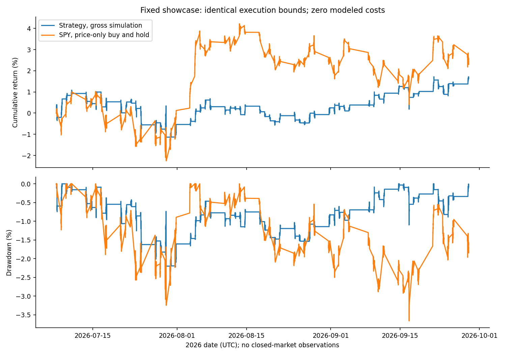
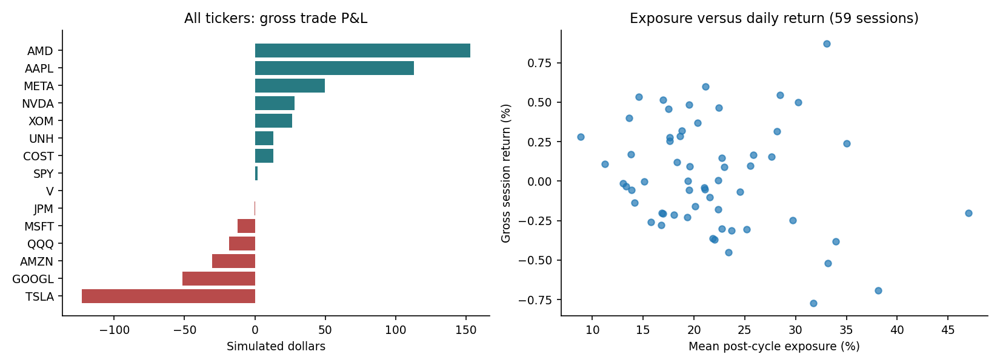
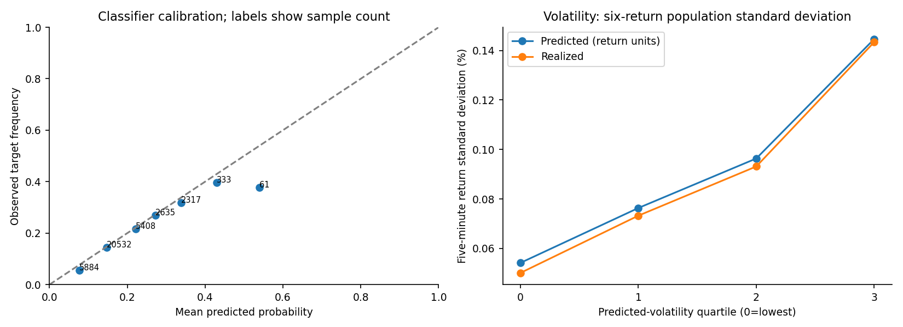
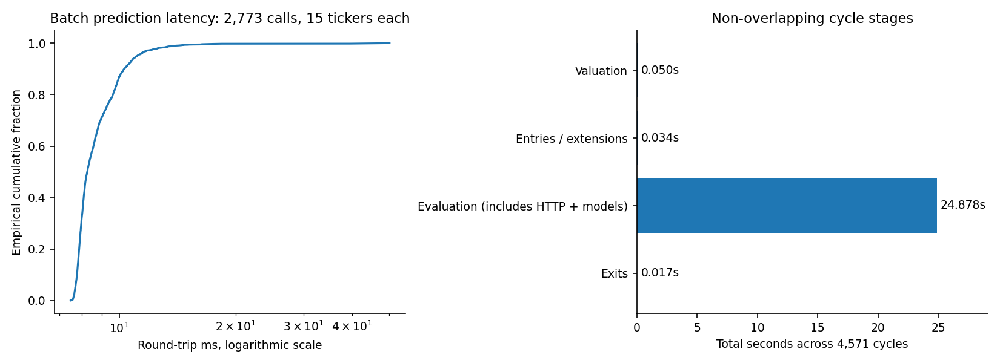

# Fixed showcase exploratory analytics

Run `2ef02c28-189c-447a-af1e-880d15f9e575`. Gross historical simulation; no strategy rerun or parameter changes.

The strongest presentation evidence is engineering and auditability. The run handled 41,595 ticker predictions in 27.295s; full 15-ticker round trips had 8.266ms median latency. Gross strategy return was 1.632% versus SPY 2.299%, with limited cost headroom and no established trading alpha. The 21 zero-volume candles remain disclosed. Volatility units are decoded from provenance; this report does not change any recorded fills. See [findings.md](findings.md) for complete A/B/C classifications and qualifications.

Benchmark: buy 13.374884947 fractional SPY shares at $747.669982910 on 2026-07-07 16:05:00+00:00; sell at $764.859985352 on 2026-09-28 19:55:00+00:00. Same $10,000 initial capital, exact candle-open execution, zero modeled costs and no dividends/interest. SPY holds overnight; the strategy does not.

## Results

| metric | value |
|---|---|
| initial_equity | 10000 |
| terminal_equity | 10163.2 |
| gross_pnl | 163.241 |
| total_return | 0.0163241 |
| spy_total_return | 0.0229914 |
| excess_return_percentage_points | -0.666736 |
| max_drawdown | -0.0233636 |
| spy_max_drawdown | -0.0366135 |
| drawdown_peak_time | 2026-07-10 18:15:00+00:00 |
| drawdown_trough_time | 2026-07-30 16:45:00+00:00 |
| drawdown_recovery_time | 2026-09-14 16:20:00+00:00 |
| max_drawdown_duration_market_samples | 3486 |
| sessions | 59 |
| positive_sessions | 29 |
| daily_sharpe_annualized_descriptive | 1.31662 |
| daily_volatility_annualized_descriptive | 0.0536081 |
| daily_correlation_to_spy | 0.307896 |
| daily_beta_to_spy | 0.145045 |

## Trades

| metric | value |
|---|---|
| trades | 545 |
| sessions | 59 |
| wins | 286 |
| losses | 258 |
| flat | 1 |
| win_rate | 0.524771 |
| total_pnl | 163.241 |
| mean_pnl | 0.299524 |
| median_pnl | 0.222493 |
| mean_return | 0.00016179 |
| median_return | 0.000301811 |
| entry_capital_weighted_return | 0.000256572 |
| gross_wins | 1636.17 |
| gross_losses | -1472.93 |
| profit_factor | 1.11083 |
| mean_win | 5.72088 |
| mean_loss | -5.70903 |
| extended_trades | 457 |
| mean_mfe | 0.00489299 |
| mean_mae | -0.00482812 |
| longest_losing_streak_entry_order | 8 |
| longest_winning_streak_entry_order | 7 |

## Predictions

| metric | value |
|---|---|
| predictions | 41595 |
| labeled | 37170 |
| unlabeled | 4425 |
| labeled_sessions | 59 |
| positive_rate | 0.163089 |
| mean_probability | 0.170969 |
| mean_fixed_target_return | -3.61926e-05 |
| median_fixed_target_return | 0 |
| mean_open_to_open_return | -3.40085e-05 |
| open_return_labeled | 36285 |
| brier | 0.130962 |
| auc | 0.654661 |
| log_loss | 0.424225 |
| mean_predicted_volatility_return_units | 0.00090653 |
| mean_realized_volatility | 0.000876833 |
| volatility_mae | 0.000299068 |
| target_scale | 1000 |
| sample_base_rate_brier | 0.136491 |
| sample_base_rate_log_loss | 0.444756 |
| volatility_rmse | 0.000451973 |
| volatility_bias | 2.96969e-05 |
| volatility_pearson | 0.646491 |
| volatility_spearman | 0.670935 |
| volatility_metadata_mean_baseline_mae | 0.000446433 |
| fixed_target_vs_executable_return_correlation | 0.99835 |
| labels_realizing_after_last_execution | 15 |
| probability_volatility_spearman | 0.808446 |
| majority_class_accuracy | 0.836911 |
| brier_skill_vs_sample_base | 0.0405083 |
| volatility_mae_reduction_vs_metadata_mean | 0.330094 |

## Engineering

| metric | value |
|---|---|
| market_cycles | 4571 |
| inference_cycles | 2773 |
| warmup_cycles | 1798 |
| ticker_predictions | 41595 |
| completed_trades | 545 |
| batch_size | 15 |
| full_backtest_wall_seconds | 27.295 |
| driver_seconds | 25.2526 |
| session_write_seconds | 0.291517 |
| setup_and_completion_residual_seconds | 1.7509 |
| predictions_per_full_wall_second | 1523.91 |
| cycles_per_full_wall_second | 167.467 |
| predictions_per_prediction_roundtrip_second | 1698.03 |
| first_inference_ms | 39.521 |
| window_seconds | 0.268185 |
| prediction_seconds | 24.4961 |
| decision_seconds | 0.0985417 |
| cycle_overhead_seconds | 0.0015488 |
| inference_latency_spearman_with_positions | 0.221238 |
| inference_latency_spearman_with_adjustments | 0.235429 |

Latency distributions (milliseconds):

| metric | n | mean | median | p95 | p99 | max |
|---|---|---|---|---|---|---|
| prediction_roundtrip_batch_ms | 2773 | 8.83379 | 8.2659 | 11.1303 | 13.9859 | 50.0559 |
| inference_cycle_total_ms | 2773 | 8.99925 | 8.4127 | 11.3362 | 14.4731 | 52.3971 |
| warmup_cycle_total_ms | 1798 | 0.0145637 | 0.0116 | 0.03543 | 0.059806 | 0.1313 |
| amortized_batch_ms_per_ticker | 2773 | 0.588919 | 0.55106 | 0.742019 | 0.932397 | 3.33706 |
| later_inference_ms | 2772 | 8.82271 | 8.26505 | 11.1245 | 13.948 | 50.0559 |

Non-overlapping stage totals:

| stage | seconds | percent_cycle_work |
|---|---|---|
| exit_ms | 0.0174393 | 0.06981 |
| evaluation_ms | 24.8778 | 99.5867 |
| entryAndAdjustment_ms | 0.0340111 | 0.136147 |
| valuation_ms | 0.0502501 | 0.201153 |

Inference-only workload groups (has entry / has exit):

| group | n | mean | median | p95 | p99 |
|---|---|---|---|---|---|
| False / False | 2069 | 8.96079 | 8.4029 | 11.2858 | 13.7963 |
| False / True | 334 | 9.0274 | 8.41815 | 11.8323 | 14.9501 |
| True / False | 342 | 9.23663 | 8.50675 | 11.2204 | 15.6299 |
| True / True | 28 | 8.60555 | 8.2801 | 10.0073 | 11.0662 |

## Risk and concentration

| metric | value |
|---|---|
| invested_cycle_fraction | 0.554364 |
| max_single_ticker_equity_weight | 0.203433 |
| max_top3_equity_weight | 0.512762 |
| exposure_drawdown_correlation | 0.0144183 |
| daily_exposure_daily_return_correlation | -0.216009 |
| equity_turnover | 126.881 |
| total_traded_notional | 1.27264e+06 |
| linear_break_even_cost_bps | 1.2827 |
| top5_winners_share_gross_wins | 0.142826 |
| top5_winners_share_net_pnl | 1.43156 |
| largest_ticker_pnl | 152.914 |
| largest_ticker | AMD |
| pnl_excluding_top5_winners | -70.4474 |
| pnl_excluding_largest_ticker | 10.3266 |

Exposure/concentration distributions:

| metric | n | mean | median | p95 | max |
|---|---|---|---|---|---|
| exposure | 4571 | 0.216518 | 0.199475 | 0.615482 | 0.887298 |
| inference_cycle_exposure | 2773 | 0.356908 | 0.360565 | 0.672487 | 0.887298 |
| concurrent_tickers | 4571 | 1.78648 | 1 | 6 | 13 |
| invested_hhi | 2534 | 0.483895 | 0.374911 | 1 | 1 |

Fixed-fill cost arithmetic (not a strategy rerun; one-way cost applies to every buy and sell notional):

| one_way_bps | hypothetical_pnl |
|---|---|
| 1 | 35.9769 |
| 5 | -473.078 |
| 10 | -1109.4 |

## Session-block uncertainty

| metric | estimate | lower95 | upper95 | sessions | block_sessions | resamples |
|---|---|---|---|---|---|---|
| mean_daily_strategy_return | 0.000280086 | -0.000473897 | 0.00102051 | 59 | 5 | 2000 |
| mean_daily_excess_return | -0.000130472 | -0.00172916 | 0.001319 | 59 | 5 | 2000 |
| mean_trade_pnl | 0.299524 | -0.503505 | 1.11125 | 59 | 5 | 2000 |
| brier_advantage_vs_sample_base | 0.005529 | 0.00425281 | 0.00683628 | 59 | 5 | 2000 |
| volatility_mae_advantage_vs_metadata_mean | 0.000147365 | 0.00013579 | 0.000159902 | 59 | 5 | 2000 |

59 sessions; circular moving blocks of 5 sessions, 2000 resamples, fixed seed. Preserve cross-ticker/within-session dependence. Intervals are exploratory, not corrected for subgroup search or evidence of future generalization. No subgroup is a separately validated strategy. No significance claim is made.

## Coverage and reliability

| metric | value |
|---|---|
| sessions | 59 |
| candles_per_ticker | {'AAPL': 4602, 'MSFT': 4602, 'NVDA': 4602, 'AMD': 4602, 'GOOGL': 4602, 'AMZN': 4602, 'META': 4602, 'TSLA': 4602, 'JPM': 4602, 'V': 4602, 'XOM': 4602, 'UNH': 4602, 'COST': 4602, 'SPY': 4602, 'QQQ': 4602} |
| tickers | 15 |
| zero_volume_candles | 21 |
| predictions_with_zero_volume_input | 420 |
| zero_volume_affected_cycles | 372 |
| session_failures | 0 |
| cycle_failures | 0 |
| failed_entries | 0 |
| failed_exits | 0 |
| missing_or_stale_marks | 0 |
| partial_inference_batches | 0 |
| unanticipated_skips | 0 |
| labeled_predictions | 37170 |
| unlabeled_predictions | 4425 |
| unlabeled_reason | Final five inference cycles of each session lack six contiguous future five-minute candles; no overnight stitching. |

## Diagnostic subgroup tables

Returns and rates are fractions, not percentages. Small groups are descriptive only; observations overlap across time and share market shocks.

### trades_by_ticker

| group | trades | sessions | win_rate | total_pnl | mean_return | profit_factor | extended_trades |
|---|---|---|---|---|---|---|---|
| AAPL | 30 | 23 | 0.566667 | 112.923 | 0.0026001 | 4.37436 | 21 |
| AMD | 90 | 59 | 0.555556 | 152.914 | 0.000872833 | 1.34281 | 88 |
| AMZN | 38 | 32 | 0.421053 | -30.3164 | -0.00129652 | 0.522479 | 26 |
| COST | 2 | 2 | 1 | 12.9617 | 0.00424365 | N/A | 2 |
| GOOGL | 37 | 30 | 0.459459 | -51.5463 | -0.00166449 | 0.361914 | 32 |
| JPM | 16 | 13 | 0.5 | -0.0780734 | -0.000140214 | 0.993601 | 13 |
| META | 78 | 51 | 0.576923 | 49.6068 | 0.000671052 | 1.23236 | 67 |
| MSFT | 37 | 28 | 0.513514 | -12.1557 | 4.13625e-05 | 0.823412 | 31 |
| NVDA | 45 | 33 | 0.555556 | 28.3676 | 0.00130061 | 1.23838 | 36 |
| QQQ | 11 | 9 | 0.545455 | -18.1247 | -0.00123505 | 0.2668 | 8 |
| SPY | 3 | 3 | 1 | 1.75227 | 0.0012228 | N/A | 2 |
| TSLA | 105 | 56 | 0.457143 | -122.714 | -0.000793082 | 0.609438 | 89 |
| UNH | 18 | 13 | 0.611111 | 13.0215 | -0.000342604 | 1.28039 | 13 |
| V | 6 | 6 | 0.333333 | 0.209812 | -3.76498e-05 | 1.03083 | 5 |
| XOM | 29 | 24 | 0.586207 | 26.4185 | 0.000807284 | 1.60813 | 24 |

### trades_by_extension

| group | trades | sessions | win_rate | total_pnl | mean_return | profit_factor | extended_trades |
|---|---|---|---|---|---|---|---|
| False | 88 | 38 | 0.693182 | 103.512 | 0.00106426 | 2.29917 | 0 |
| True | 457 | 59 | 0.492341 | 59.7283 | -1.19902e-05 | 1.04287 | 457 |

### trades_by_probability

| group | trades | sessions | win_rate | total_pnl | mean_return | profit_factor | extended_trades |
|---|---|---|---|---|---|---|---|
| [0.25, 0.3) | 441 | 59 | 0.517007 | 43.6097 | 4.98236e-05 | 1.04652 | 354 |
| [0.3, 0.4) | 102 | 50 | 0.558824 | 133.427 | 0.000870261 | 1.25643 | 101 |
| [0.4, 0.5) | 1 | 1 | 1 | 1.37887 | 0.000692637 | N/A | 1 |
| [0.5, 0.75) | 1 | 1 | 0 | -15.1747 | -0.0232558 | 0 | 1 |

### trades_by_volatility

| group | trades | sessions | win_rate | total_pnl | mean_return | profit_factor | extended_trades |
|---|---|---|---|---|---|---|---|
| 0 | 1 | 1 | 1 | 3.01362 | 0.00174913 | N/A | 0 |
| 1 | 28 | 21 | 0.535714 | 8.30579 | 0.000266497 | 1.2296 | 21 |
| 2 | 143 | 51 | 0.517483 | 25.5304 | 0.000243608 | 1.12624 | 104 |
| 3 | 373 | 59 | 0.525469 | 126.391 | 0.000118308 | 1.10238 | 332 |

### predictions_by_ticker

| group | predictions | labeled | labeled_sessions | positive_rate | mean_probability | mean_fixed_target_return | brier | auc | volatility_mae |
|---|---|---|---|---|---|---|---|---|---|
| AAPL | 2773 | 2478 | 59 | 0.182809 | 0.155646 | 0.000175261 | 0.145565 | 0.619844 | 0.000285751 |
| AMD | 2773 | 2478 | 59 | 0.297821 | 0.284619 | 1.28822e-05 | 0.203805 | 0.603017 | 0.000538996 |
| AMZN | 2773 | 2478 | 59 | 0.181598 | 0.172473 | -5.96415e-05 | 0.147956 | 0.568202 | 0.000309895 |
| COST | 2773 | 2478 | 59 | 0.0895884 | 0.104963 | -6.90237e-05 | 0.0806121 | 0.615889 | 0.000208821 |
| GOOGL | 2773 | 2478 | 59 | 0.176755 | 0.182823 | -9.58536e-05 | 0.14644 | 0.575627 | 0.000321048 |
| JPM | 2773 | 2478 | 59 | 0.108152 | 0.155418 | -5.91911e-05 | 0.0970315 | 0.614066 | 0.000240746 |
| META | 2773 | 2478 | 59 | 0.236077 | 0.226035 | 6.5868e-05 | 0.181091 | 0.546904 | 0.00044449 |
| MSFT | 2773 | 2478 | 59 | 0.17958 | 0.17254 | 1.76601e-05 | 0.145799 | 0.58726 | 0.000280814 |
| NVDA | 2773 | 2478 | 59 | 0.220743 | 0.195864 | -4.99004e-05 | 0.166261 | 0.623636 | 0.000354975 |
| QQQ | 2773 | 2478 | 59 | 0.0726392 | 0.118687 | -1.97961e-05 | 0.0680645 | 0.675271 | 0.000178446 |
| SPY | 2773 | 2478 | 59 | 0.0242131 | 0.0893022 | -3.24805e-05 | 0.0285889 | 0.637055 | 0.000140853 |
| TSLA | 2773 | 2478 | 59 | 0.233253 | 0.237436 | -0.000221549 | 0.180946 | 0.531094 | 0.000430832 |
| UNH | 2773 | 2478 | 59 | 0.16021 | 0.154671 | -0.00021454 | 0.130703 | 0.641953 | 0.00026114 |
| V | 2773 | 2478 | 59 | 0.106538 | 0.139774 | 5.47584e-06 | 0.09618 | 0.55075 | 0.000216062 |
| XOM | 2773 | 2478 | 59 | 0.176352 | 0.174284 | 1.94028e-06 | 0.145381 | 0.512942 | 0.000273149 |

### predictions_by_probability

| group | predictions | labeled | labeled_sessions | positive_rate | mean_probability | mean_fixed_target_return | brier | auc | volatility_mae |
|---|---|---|---|---|---|---|---|---|---|
| [0.0, 0.1) | 5908 | 5884 | 59 | 0.0545547 | 0.076667 | -7.12409e-05 | 0.051882 | 0.580806 | 0.000174452 |
| [0.1, 0.2) | 21634 | 20532 | 59 | 0.144506 | 0.147472 | -5.55455e-05 | 0.123029 | 0.558122 | 0.00027083 |
| [0.2, 0.25) | 7224 | 5408 | 59 | 0.216346 | 0.221345 | -2.83676e-05 | 0.1694 | 0.521331 | 0.000357628 |
| [0.25, 0.3) | 3546 | 2635 | 59 | 0.269829 | 0.272645 | 5.06173e-05 | 0.196716 | 0.526557 | 0.000417032 |
| [0.3, 0.4) | 2860 | 2317 | 59 | 0.318515 | 0.338449 | 9.37e-06 | 0.218305 | 0.499821 | 0.000522691 |
| [0.4, 0.5) | 362 | 333 | 27 | 0.396396 | 0.430431 | 0.000975361 | 0.239889 | 0.530341 | 0.000706306 |
| [0.5, 0.75) | 61 | 61 | 8 | 0.377049 | 0.540007 | -0.0018378 | 0.268642 | 0.386728 | 0.000819599 |

### predictions_by_volatility

| group | predictions | labeled | labeled_sessions | positive_rate | mean_probability | mean_fixed_target_return | brier | auc | volatility_mae |
|---|---|---|---|---|---|---|---|---|---|
| 0 | 10399 | 10104 | 59 | 0.0634402 | 0.103101 | 1.26338e-06 | 0.0608466 | 0.608067 | 0.000175738 |
| 1 | 10399 | 9777 | 59 | 0.136034 | 0.147878 | -2.99709e-05 | 0.118103 | 0.532557 | 0.000246648 |
| 2 | 10398 | 8798 | 59 | 0.196295 | 0.183131 | -3.66472e-05 | 0.15894 | 0.521368 | 0.000323074 |
| 3 | 10399 | 8491 | 59 | 0.278412 | 0.265716 | -8.74568e-05 | 0.200213 | 0.563041 | 0.00048131 |

### probability_volatility_interaction

| group | predictions | labeled | labeled_sessions | positive_rate | mean_probability | mean_fixed_target_return | brier | auc | volatility_mae |
|---|---|---|---|---|---|---|---|---|---|
| [0.0, 0.1) / 0 | 5097 | 5097 | 59 | 0.0429665 | 0.0748071 | -4.03261e-05 | 0.0420035 | 0.583999 | 0.000157408 |
| [0.0, 0.1) / 1 | 704 | 685 | 56 | 0.116788 | 0.0900226 | -0.000168714 | 0.10442 | 0.451302 | 0.000253846 |
| [0.0, 0.1) / 2 | 73 | 73 | 27 | 0.205479 | 0.087097 | -0.000166716 | 0.180543 | 0.309195 | 0.000291594 |
| [0.0, 0.1) / 3 | 34 | 29 | 6 | 0.241379 | 0.061835 | -0.00296206 | 0.223268 | 0.279221 | 0.000999751 |
| [0.1, 0.2) / 0 | 4969 | 4891 | 59 | 0.0840319 | 0.129989 | 4.43201e-05 | 0.0795416 | 0.519341 | 0.000194135 |
| [0.1, 0.2) / 1 | 8673 | 8257 | 59 | 0.137096 | 0.145191 | -2.05375e-05 | 0.118283 | 0.535518 | 0.000245501 |
| [0.1, 0.2) / 2 | 6362 | 5835 | 59 | 0.187147 | 0.158373 | -7.74969e-05 | 0.153584 | 0.499792 | 0.000323708 |
| [0.1, 0.2) / 3 | 1630 | 1549 | 57 | 0.214332 | 0.173769 | -0.000474795 | 0.170536 | 0.507346 | 0.000448822 |
| [0.2, 0.25) / 0 | 329 | 115 | 42 | 0.0956522 | 0.212327 | -9.42429e-07 | 0.10089 | 0.41958 | 0.000204531 |
| [0.2, 0.25) / 1 | 919 | 757 | 59 | 0.136063 | 0.216827 | -3.98539e-05 | 0.12392 | 0.514778 | 0.00024682 |
| [0.2, 0.25) / 2 | 2910 | 2137 | 59 | 0.210576 | 0.220243 | 5.04107e-05 | 0.166075 | 0.527003 | 0.000320737 |
| [0.2, 0.25) / 3 | 3066 | 2399 | 59 | 0.252605 | 0.224185 | -9.62327e-05 | 0.189997 | 0.489144 | 0.000432794 |
| [0.25, 0.3) / 0 | 4 | 1 | 1 | 0 | 0.25013 | 0.00164607 | 0.0625651 | N/A | 0.000315004 |
| [0.25, 0.3) / 1 | 95 | 71 | 27 | 0.211268 | 0.266887 | 0.000299075 | 0.16887 | 0.554762 | 0.000292283 |
| [0.25, 0.3) / 2 | 879 | 616 | 57 | 0.225649 | 0.268855 | -5.64483e-05 | 0.176363 | 0.523868 | 0.000335862 |
| [0.25, 0.3) / 3 | 2568 | 1947 | 59 | 0.286081 | 0.274066 | 7.46113e-05 | 0.204239 | 0.517342 | 0.000447315 |
| [0.3, 0.4) / 1 | 8 | 7 | 3 | 0 | 0.315603 | 0.000150995 | 0.0998153 | N/A | 0.000414838 |
| [0.3, 0.4) / 2 | 174 | 137 | 32 | 0.226277 | 0.324434 | 0.000503558 | 0.185902 | 0.468046 | 0.000291794 |
| [0.3, 0.4) / 3 | 2678 | 2173 | 59 | 0.325357 | 0.339406 | -2.22431e-05 | 0.220729 | 0.49512 | 0.000537596 |
| [0.4, 0.5) / 3 | 362 | 333 | 27 | 0.396396 | 0.430431 | 0.000975361 | 0.239889 | 0.530341 | 0.000706306 |
| [0.5, 0.75) / 3 | 61 | 61 | 8 | 0.377049 | 0.540007 | -0.0018378 | 0.268642 | 0.386728 | 0.000819599 |

### predictions_by_decision

| group | predictions | labeled | labeled_sessions | positive_rate | mean_probability | mean_fixed_target_return | brier | auc | volatility_mae |
|---|---|---|---|---|---|---|---|---|---|
| ALLOCATION_REQUESTED | 206 | 206 | 54 | 0.315534 | 0.289727 | -2.63805e-05 | 0.216063 | 0.552646 | 0.000472275 |
| BELOW_PROBABILITY_THRESHOLD | 31190 | 31190 | 59 | 0.138827 | 0.145949 | -5.47713e-05 | 0.116869 | 0.625815 | 0.000265829 |
| CAPPED_ALLOCATION | 339 | 339 | 59 | 0.250737 | 0.273816 | -0.000219636 | 0.185921 | 0.559889 | 0.000423143 |
| EXTEND_EXISTING_TRADE | 4550 | 4550 | 59 | 0.302418 | 0.318629 | 0.000122395 | 0.210831 | 0.543618 | 0.000488465 |
| TOO_LATE_TO_ENTER_OR_EXTEND | 5310 | 885 | 59 | 0.232768 | 0.226555 | -0.000128773 | 0.17615 | 0.57747 | 0.000408932 |

### predictions_by_probability_acceptance

| group | predictions | labeled | labeled_sessions | positive_rate | mean_probability | mean_fixed_target_return | brier | auc | volatility_mae |
|---|---|---|---|---|---|---|---|---|---|
| False | 34766 | 31824 | 59 | 0.140083 | 0.146934 | -5.3829e-05 | 0.117754 | 0.625209 | 0.00026776 |
| True | 6829 | 5346 | 59 | 0.300037 | 0.314044 | 6.87947e-05 | 0.209583 | 0.547246 | 0.000485438 |

### predictions_by_allocation

| group | predictions | labeled | labeled_sessions | positive_rate | mean_probability | mean_fixed_target_return | brier | auc | volatility_mae |
|---|---|---|---|---|---|---|---|---|---|
| False | 41050 | 36625 | 59 | 0.16142 | 0.169349 | -3.45498e-05 | 0.129974 | 0.653751 | 0.000296945 |
| True | 545 | 545 | 59 | 0.275229 | 0.27983 | -0.000146589 | 0.197314 | 0.57546 | 0.000441714 |

### predictions_by_zero_volume

| group | predictions | labeled | labeled_sessions | positive_rate | mean_probability | mean_fixed_target_return | brier | auc | volatility_mae |
|---|---|---|---|---|---|---|---|---|---|
| False | 41175 | 36809 | 59 | 0.163547 | 0.170686 | -3.5337e-05 | 0.131129 | 0.656333 | 0.000299392 |
| True | 420 | 361 | 14 | 0.116343 | 0.199863 | -0.000123429 | 0.113863 | 0.491267 | 0.00026597 |

### exposure_vs_drawdown

| group | cycles | mean_drawdown | worst_drawdown |
|---|---|---|---|
| (-0.002, 0.0] | 2037 | -0.00817952 | -0.0219798 |
| (0.0, 0.25] | 560 | -0.00887258 | -0.0209572 |
| (0.25, 0.5] | 1369 | -0.00819304 | -0.0222151 |
| (0.5, 0.75] | 557 | -0.00777422 | -0.0233636 |
| (0.75, 1.001] | 48 | -0.00866813 | -0.0207442 |

### movement_by_volatility_quartile

| group | labeled | positive_threshold_rate | negative_threshold_rate | positive_direction_rate | mean_fixed_target_return | classifier_auc |
|---|---|---|---|---|---|---|
| 0 | 10104 | 0.0634402 | 0.0696754 | 0.502177 | 1.26338e-06 | 0.608067 |
| 1 | 9777 | 0.136034 | 0.146875 | 0.502813 | -2.99709e-05 | 0.532557 |
| 2 | 8798 | 0.196295 | 0.203001 | 0.495794 | -3.66472e-05 | 0.521368 |
| 3 | 8491 | 0.278412 | 0.286068 | 0.491462 | -8.74568e-05 | 0.563041 |

## Charts

## Definitions, calculations, and qualifications

See [METHODS.md](../../../analytics/METHODS.md) for exact field mappings and formulas, target timing, uncertainty and unit caveats. See [findings.md](findings.md) for interpretation and A/B/C classifications. See `metrics.json` for complete distributions and `*.jsonl` for every derived observation. `analysis_completion.json` binds output hashes to unchanged input hashes.

## Corrected units, model diagnostics and engineering comparison

Canonical API volatility is used unchanged (divisor 1). The legacy run is solely an engineering comparison. See [comparison.md](comparison.md) for matched trajectories, financial/latency differences and the defect case study; [findings.md](findings.md) for A/B/C classification.

| outcome | n | positive_count | classifier_auc | volatility_score_auc |
|---|---|---|---|---|
| positive_direction | 37170 | 18525 | 0.501466 | 0.494331 |
| negative_threshold | 37170 | 6355 | 0.629764 | 0.667586 |
| absolute_move | 37170 | 12417 | 0.677568 | 0.713903 |
| direction_given_large_move | 12417 |  | 0.523379 | 0.508554 |

Directional AUC five-session-block 95% interval: [0.480986, 0.519431], containing 0.5. No demonstrated directional skill.

Strict cash-P&L sign counts include one unchanged-price trade with -2.842e-14 dollars of floating-point residue. Both runs have two economically flat-price trades; see comparison.md.

Regenerate with `python analytics/analyze_corrected.py`; see [METHODS_CORRECTED.md](../../../analytics/METHODS_CORRECTED.md).
